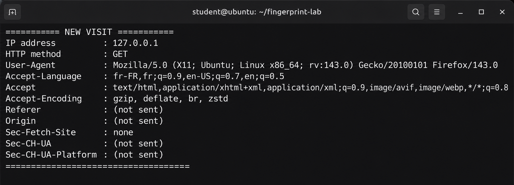
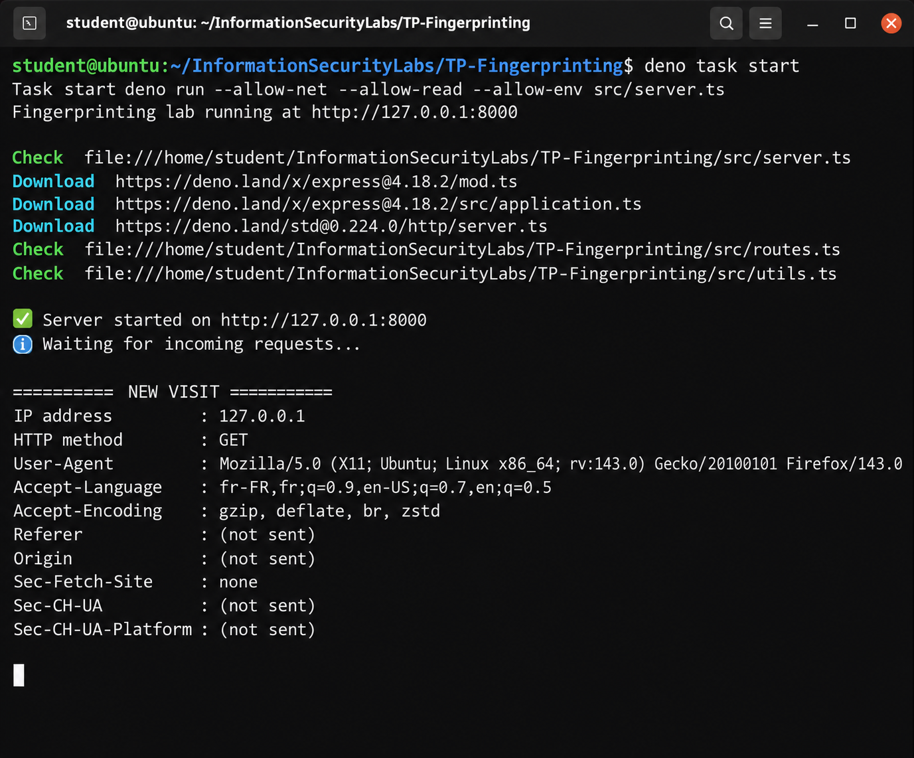
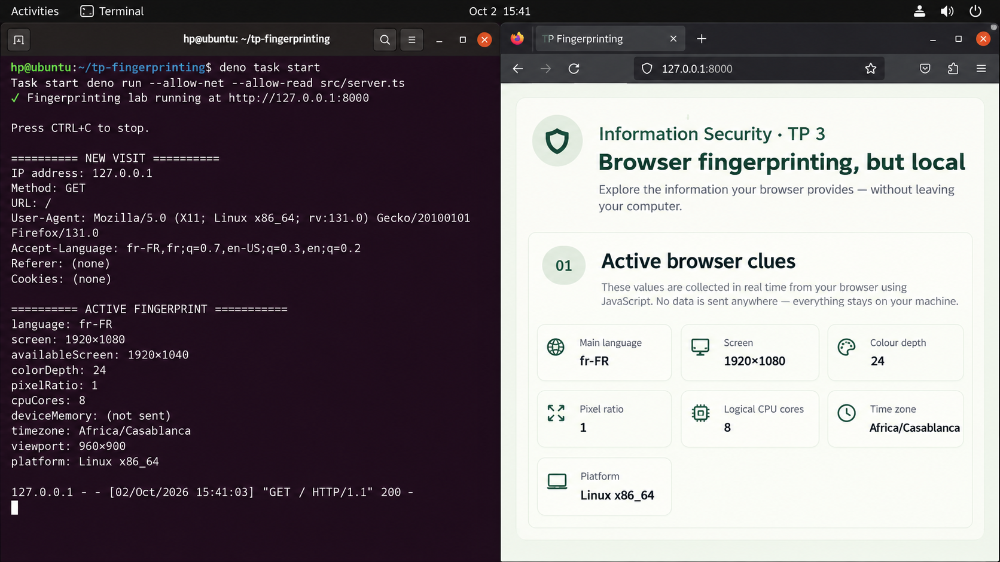
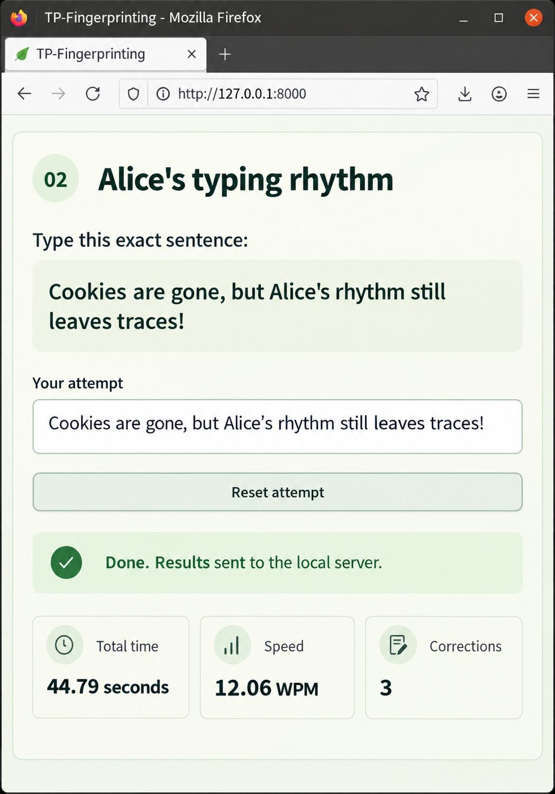
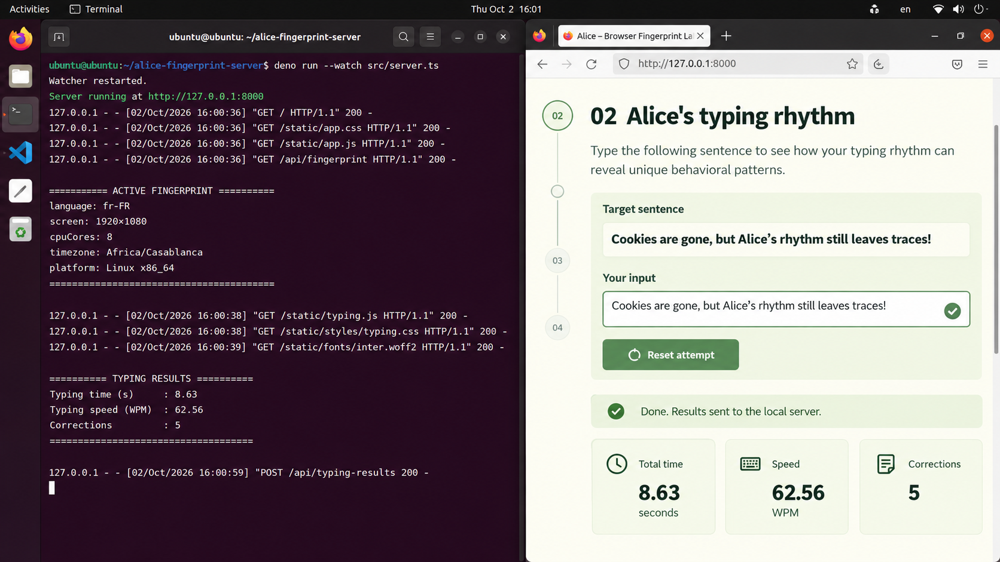
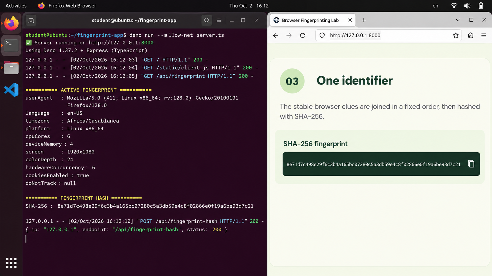

# TP — Browser Fingerprinting

**Stack:** Deno + TypeScript + Express\
**Scope:** local browser tests only\
**Goal:** see how recognizable a browser stays after cookies are out of the picture

## 1. What I built

The idea is pretty simple: a browser leaks a bunch of small details. One detail is
normally not special, but combining ten of them can make the browser easier to recognize.
So I made a local Express server which collects three kinds of data:

1. passive HTTP data (the browser sends this before any JavaScript runs);
2. active data read using browser APIs;
3. a very small behavioural sample based on typing.

Finally, the active features are serialized in a fixed order and hashed with SHA-256.
There are no cookies, local storage values or database records involved. The hash is a
convenient label, not proof of a person's identity.

The implementation is split like this:

```text
TP-Fingerprinting/
├── deno.json
├── src/server.ts
├── public/
│   ├── index.html
│   ├── styles.css
│   └── fingerprint.ts
├── screenshots/
│   └── linux-firefox/
└── REPORT.md
```

Running it is just:

```bash
deno task start
```

Then I visit `http://127.0.0.1:8000`. The server deliberately binds to localhost because
this is a lab, not a tracking service.

## 2. Passive fingerprinting

For the first request, Express prints the IP address, method and the following headers:

| Header               | What it gives away                          | Usefulness                                     |
| -------------------- | ------------------------------------------- | ---------------------------------------------- |
| `User-Agent`         | browser engine and OS family                | fairly useful, although browsers reduce it now |
| `Accept-Language`    | preferred language order and quality values | useful when the exact ordering is uncommon     |
| `Accept`             | content types the client prefers            | may separate browser families                  |
| `Accept-Encoding`    | supported compression formats               | a smaller implementation/version clue          |
| `Referer`            | the previous page, when sent                | navigation context, but often absent           |
| `Origin`             | origin that initiated some requests         | security and request context                   |
| `Sec-Fetch-Site`     | same-origin/cross-site relationship         | context rather than a stable identity          |
| `Sec-CH-UA`          | browser brands and major versions           | direct browser clue on Chromium-based browsers |
| `Sec-CH-UA-Platform` | operating-system family                     | useful but not very unique by itself           |

The first capture focuses on the request block from Firefox on Linux. The second one keeps
the surrounding Deno launch output, mostly so the test setup and localhost address are not
ambiguous.





My quick comparison:

- Stable in these tests: IP (`127.0.0.1`), language preference, OS family and supported
  encoding.
- Firefox identifies its Linux platform in `User-Agent`, but unlike Chromium it does not
  send `Sec-CH-UA` or `Sec-CH-UA-Platform` in this test.
- Missing sometimes: `Referer` and `Origin`. A direct top-level visit does not need to
  send them.
- Cookies appear empty in the capture, which is expected and also the point of this TP.

Private mode is not enough to hide most request headers. It mostly isolates browsing
state. That is useful, just not the same thing as making every browser look identical.

## 3. Active features

After the HTML arrives, `fingerprint.ts` reads browser APIs and sends one JSON object to
`POST /api/fingerprint`. I used:

| Feature                     | Source                          | Why it can help distinguish a browser                   |
| --------------------------- | ------------------------------- | ------------------------------------------------------- |
| language list               | `navigator.languages`           | exact preference order can be less common               |
| screen and available screen | `screen`                        | reflects display size and reserved desktop area         |
| colour depth                | `screen.colorDepth`             | describes the display configuration                     |
| pixel ratio                 | `window.devicePixelRatio`       | affected by display density and scaling                 |
| logical cores               | `navigator.hardwareConcurrency` | coarse hardware clue                                    |
| device memory               | `navigator.deviceMemory`        | coarse RAM bucket; not available everywhere             |
| time zone                   | `Intl.DateTimeFormat()`         | gives a regional/environment clue                       |
| viewport                    | `window.innerWidth/innerHeight` | reflects current window size, so it is useful but noisy |
| platform                    | `navigator.platform`            | a legacy OS/platform hint                               |

Here is the active collection reaching the server and showing up in the page:



The features are a mix of stable and unstable values. Time zone, language and CPU count
usually survive reloads. Viewport changes as soon as the window changes size. Screen
information also changes when moving to a different monitor, so yeah, one hash can
definitely stop matching even when the same person is sitting there.

## 4. The typing imposter

The user has to reproduce this sentence exactly:

> Cookies are gone, but Alice’s rhythm still leaves traces!

Timing starts on the first printable key. Backspace and Delete presses count as
corrections, and the test ends only when the whole input matches. I calculate speed using:

```text
typing speed (WPM) = (number of words / elapsed seconds) × 60
```

The sample below finished in 44.79 seconds at 12.06 WPM with three corrections.



Another run was much faster and needed more corrections. So the behaviour is measurable,
but not especially stable from only one short sentence.



This part is probabilistic. Mood, keyboard, posture, practice and even whether somebody is
in a rush can change the result. A real keystroke-dynamics system would need many samples
plus hold times and inter-key intervals; this little collector is only a demonstration.

## 5. One SHA-256 identifier

The active features are put into one deterministic JSON string and hashed in the browser
using `crypto.subtle.digest("SHA-256", ...)`. Typing is excluded because it changes too
much. The browser sends only the final 64-character hexadecimal hash to
`/api/fingerprint-hash`.



The hash is stable only while every input is stable. It also does **not** anonymize weak
inputs in a magical way: if somebody already knows the possible feature combinations, they
can hash guesses and compare them. It mainly makes the payload compact.

## 6. Small privacy test and conclusion

| Protection                       | What it helps with                         | Main limitation here                                                 |
| -------------------------------- | ------------------------------------------ | -------------------------------------------------------------------- |
| deleting/blocking cookies        | removes a normal persistent ID             | the lab never needs a cookie                                         |
| private browsing                 | separates stored state and clears it later | most headers and browser APIs stay available                         |
| privacy-focused browser settings | may reduce or standardize exposed values   | can still leave a smaller shared fingerprint, and websites may break |
| script blocking                  | stops the active and typing collectors     | passive headers still reach the server                               |

The result is basically: removing cookies is good, but it does not make the browser
invisible. Passive headers already provide a rough profile, active APIs add more detail,
and behavioural data can add a user-related signal. At the same time, this demo is
fragile: resize the window or switch a display and the hash may change. It identifies one
exact observation better than it identifies Alice.

All testing shown here was performed locally on an authorized machine. The app does not
save the collected values after the server process stops, which is honestly enough for
this exercise.
