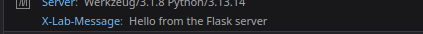
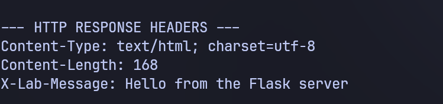
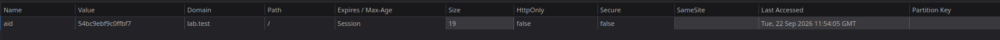
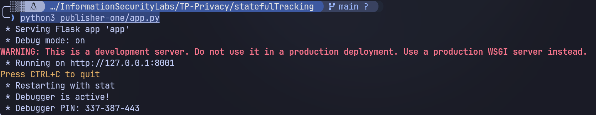
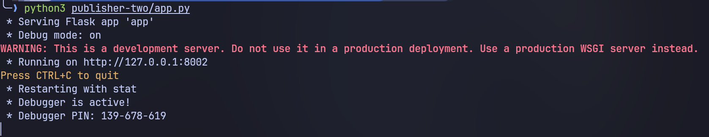
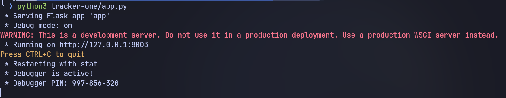
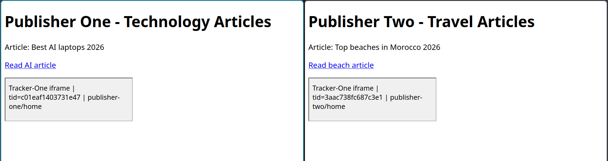

# TP Privacy - Stateful Tracking - mini report

did setup + sec3 + sec4 base + challenge1 start. time was only enough for up until this (challenge1 5a).

## 1. setup

made venv, installed flask, made app.py + templates/index.html. server on 127.0.0.1:8000.

## 2. headers (sec3)

added X-Lab-Message header + print request/response headers in terminal.
saw request headers from browser and response headers with X-Lab-Message.

explain: browser sends Host, User-Agent etc. server returns Content-Type + custom X-Lab-Message. same seen in terminal.

## 3. cookies (sec4 base)

added aid cookie with secrets.token_hex(8). first visit Set-Cookie, second visit no Set-Cookie, just Cookie sent back.

cookie aid=54bc9e... on lab.test, Path=/, Session. survived restart (session restore). so server recognizes Alice.

skipped attributes tests (no time).

## 4. challenge1 - third party (only 5a)

added hosts:

ran 3 servers:

- publisher-one :8001 tech
- publisher-two :8002 travel
- tracker-one :8003 /track?publisher=... with iframe

both publishers show iframe:

observe: tid different (c01eaf... vs 3aac73...). so tracker gave different id per publisher. means third-party cookie blocked by browser (modern default). no combined profile, 2 separate profiles. need Allow third-party cookies + SameSite=None; Secure over HTTPS to fix, no time to do.

## code location

statefulTracking/app.py, publisher-one/, publisher-two/, tracker-one/
